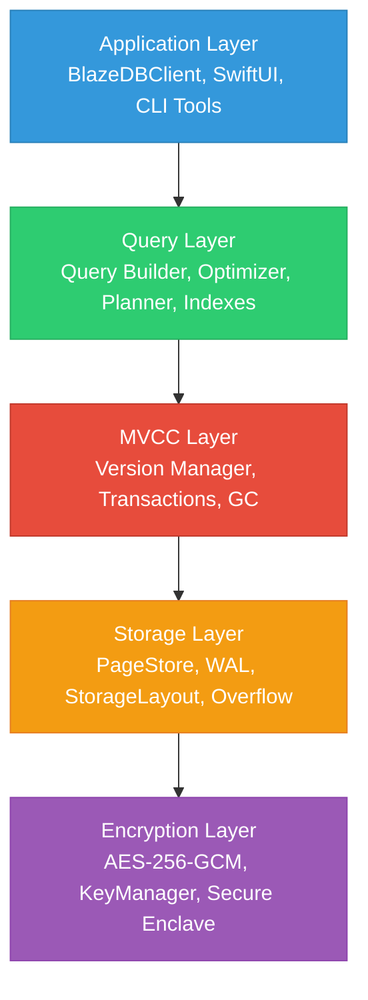
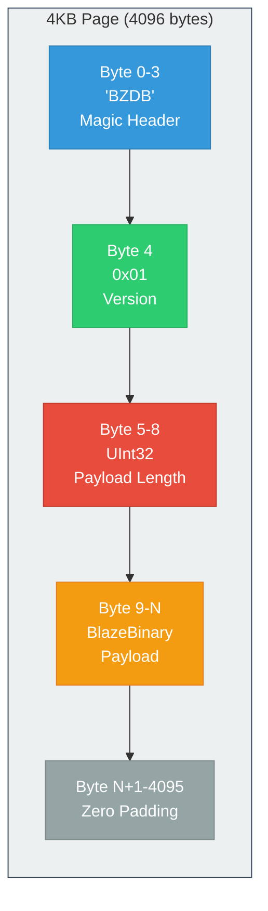
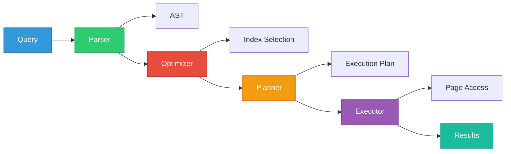

# BlazeDB Architecture

**System layers, storage engine, MVCC, and query execution.**

---

## Design Intent

BlazeDB uses a layered architecture to separate storage, concurrency, query execution, and encryption concerns. The system assumes page-based storage with fixed-size I/O, MVCC for concurrency, and per-page encryption granularity. This design enables predictable performance, efficient garbage collection, and clear debugging boundaries.

---

## System Layers

BlazeDB uses a layered architecture with clear separation of concerns:



---

## Storage Engine

### Page Structure

BlazeDB uses 4KB fixed-size pages:



**Max payload:** 4087 bytes (4096 - 9 byte overhead)

### File Layout

```
bugs.blaze              - Main data file (4KB pages)
bugs.meta               - Layout metadata (JSON)
bugs.meta.indexes       - Secondary index data (JSON)
txn_log.json           - Transaction log (WAL)
```

### Metadata Format

The `.meta` file stores:
- UUID → page index mapping
- Secondary index definitions
- Schema version information
- Field type metadata

---

## MVCC (Multi-Version Concurrency Control)

### Architecture

MVCC enables snapshot isolation: readers see a consistent snapshot while writers create new versions without blocking.

```swift
struct VersionedPage {
    let version: Int
    let data: Data
    let xmin: UUID  // Transaction that created this
    let xmax: UUID? // Transaction that deleted this
}

// Readers see snapshot
func read(id: UUID, snapshot: Snapshot) -> Data? {
    return versions[id]?
        .filter { snapshot.isVisible($0) }
        .last?.data
}

// Writers create new version (don't block)
func write(id: UUID, data: Data, txID: UUID) {
    let newVersion = VersionedPage(
        version: nextVersion(id),
        data: data,
        xmin: txID,
        xmax: nil
    )
    versions[id]?.append(newVersion)
}
```

### Characteristics

- Multiple concurrent readers AND writers
- Write throughput: ~10,000-50,000 ops/sec
- Read throughput: ~50,000+ ops/sec
- No read-write blocking

### Garbage Collection

Obsolete versions are collected automatically:
- Long-running read transactions delay GC
- Automatic collection runs periodically
- Manual triggers available if needed

---

## Query Execution

### Query Planner

Uses rule-based heuristics (cost-based optimizer planned):

1. **Index Selection**: Analyzes WHERE clauses to select optimal index
2. **Join Planning**: Determines join order and algorithm
3. **Filter Pushdown**: Applies filters as early as possible
4. **Projection**: Selects only required fields

### Index Types

- **Secondary Indexes**: Hash-based lookups for equality
- **Compound Indexes**: Multi-field indexes for complex queries
- **Full-Text Search**: Inverted index for text queries
- **Spatial Index**: R-tree for geospatial queries
- **Vector Index**: Approximate nearest neighbor search

### Execution Flow



---

## Concurrency Model

### Current Implementation

GCD concurrent queue with barriers:
- Multiple concurrent readers
- Single writer at a time (bottleneck)
- Write throughput: ~2,000-5,000 ops/sec
- Read throughput: ~10,000+ ops/sec

### MVCC Implementation

- Multiple concurrent readers AND writers
- Snapshot isolation per transaction
- No read-write blocking
- Write throughput: ~10,000-50,000 ops/sec

---

## Design Decisions

### Why Page-Based Storage?

- Simple to implement
- Predictable performance (fixed-size I/O)
- Easy to reason about
- Tradeoff: Internal fragmentation (wasted space)

### Why BlazeBinary over JSON?

- 53% smaller than JSON
- 48% faster encode/decode
- Deterministic encoding
- Field name compression
- Tradeoff: Less human-readable for debugging

### Why MVCC over Locking?

- No read-write blocking
- Better concurrency
- Snapshot isolation
- Tradeoff: Storage overhead for versions

---

For detailed protocol specifications, see [PROTOCOL.md](PROTOCOL.md).  
For transaction details, see [TRANSACTIONS.md](TRANSACTIONS.md).  
For security architecture, see [SECURITY.md](SECURITY.md).

