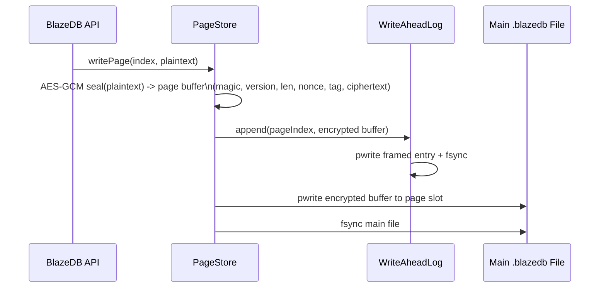
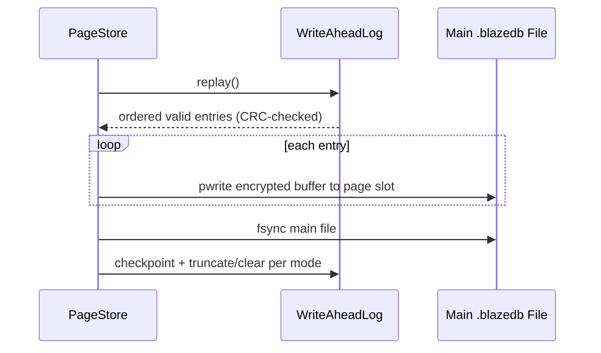
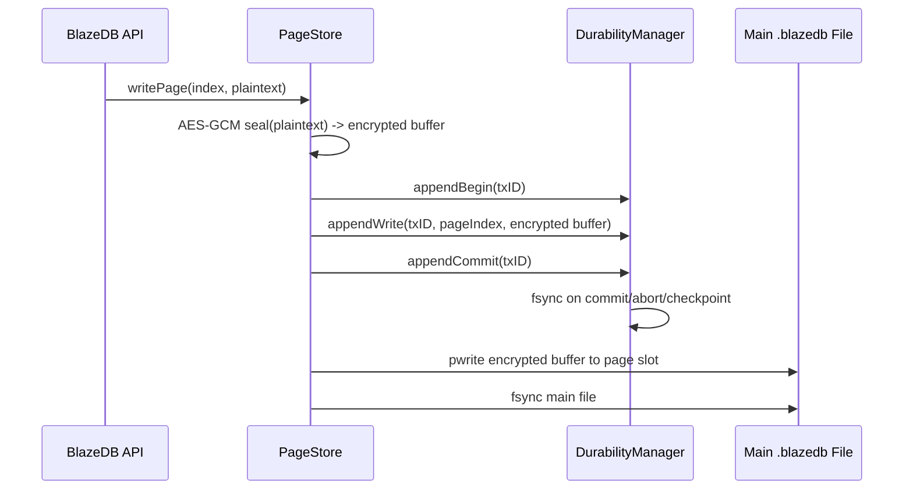
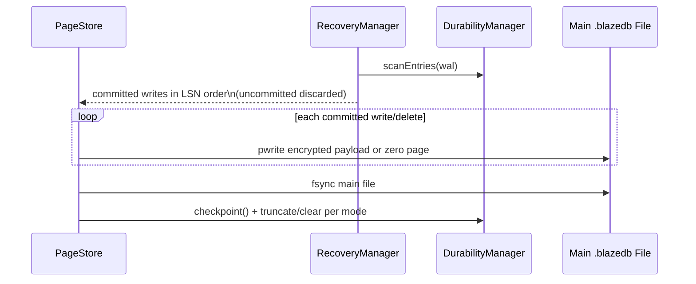

# BlazeDB Storage Engine Notes

This note explains how BlazeDB currently combines encryption, WAL durability, and page I/O.

It is intentionally implementation-driven, based on current engine behavior in `PageStore`, `WriteAheadLog`, `DurabilityManager`, and `RecoveryManager`.

This is an architectural mental model, not a claim that the current implementation is perfectly compartmentalized. Some responsibilities still overlap across storage metadata handling and legacy/new durability paths.

## At a Glance

- Records use a flexible key/value document-style shape rather than fixed application structs.
- On each page write, payloads are encrypted with AES-GCM using a newly generated nonce before persistence.
- In `PageStore` WAL paths, WAL stores encrypted page buffers (not plaintext deltas).
- In unified mode, crash replay applies committed WAL page buffers back to page slots; legacy replay uses CRC-validated WAL entries.
- Decryption/authentication occurs on page reads.
- Metadata integrity is protected via HMAC-backed layout validation.

## Legacy WAL Flow (`WALMode.legacy`)

Recovery on open:

## Unified WAL Flow (`WALMode.unified`)

Recovery on open:

## Encryption and Page Format

- Page encryption uses AES-GCM with a newly generated nonce per encryption operation.
- Benchmark-only builds can disable encryption via `BLAZEDB_BENCHMARK_NO_ENCRYPTION` for performance isolation.
- Current encrypted page layout in `PageStore` is:
- 4 bytes magic (`BZDB`)
- 1 byte version (`0x02` encrypted, `0x01` plaintext legacy)
- 4 bytes plaintext length
- 12 bytes nonce
- 16 bytes GCM tag
- ciphertext
- On read, the engine reconstructs `AES.GCM.SealedBox` and calls `AES.GCM.open`.
- Authentication failure is treated as corruption or key mismatch, and the read is rejected.

## Key Management Model (Current)

- Per-database salt is stored in sidecar `.salt` file (16 random bytes).
- Data key is derived from password + per-database salt using a PBKDF2-SHA256-based scheme (`KeyManager`), with compatibility paths for older database formats.
- PBKDF2 iteration count is configured higher in non-test environments and is environment-overridable.
- In-memory key caching exists for active DB paths.
- Secure Enclave integration exists but default DB open path is password-derived key.
- Metadata layout uses a secure wrapper (`StorageLayout+Security`) and protects layout metadata integrity with HMAC to detect layout corruption, unauthorized modification, or wrong integrity key material.
- BlazeDB also includes a legacy `TransactionLog` journaling path used by transaction code; this is separate from the `PageStore` WAL implementations above.

## Known Trade-offs

> **Reality check for systems engineers**

- **Nonce policy**: relies on per-write nonce generation, not persisted monotonic page counters.
- **CPU overhead**: every write path pays AES-GCM seal cost; read path pays open cost on cache miss.
- **WAL payload size**: WAL stores full encrypted page buffers, increasing write amplification.
- **Recovery semantics**: unified mode is transaction-aware and replays committed writes only; legacy and unified paths coexist.
- **Corruption handling**: WAL entries are protected by CRC-based integrity checks; page-level tamper/auth failures surface on read/decrypt.
- **Key lifecycle**: robust derivation exists, but operational policy (rotation/escrow/HSM practices) remains deployment-dependent.

## What This Means in Practice

- With WAL enabled, `PageStore` durability is WAL-first, while legacy transaction journaling paths still coexist.
- Encryption is integrated into the page primitive, not bolted on after WAL.
- Crash recovery remains feasible because WAL replays encrypted page buffers directly back into page slots.
- The deepest operational questions are not "is AES-GCM used?" but:
- key lifecycle,
- nonce governance under extreme write rates,
- and performance tuning under encrypted full-page replay.
