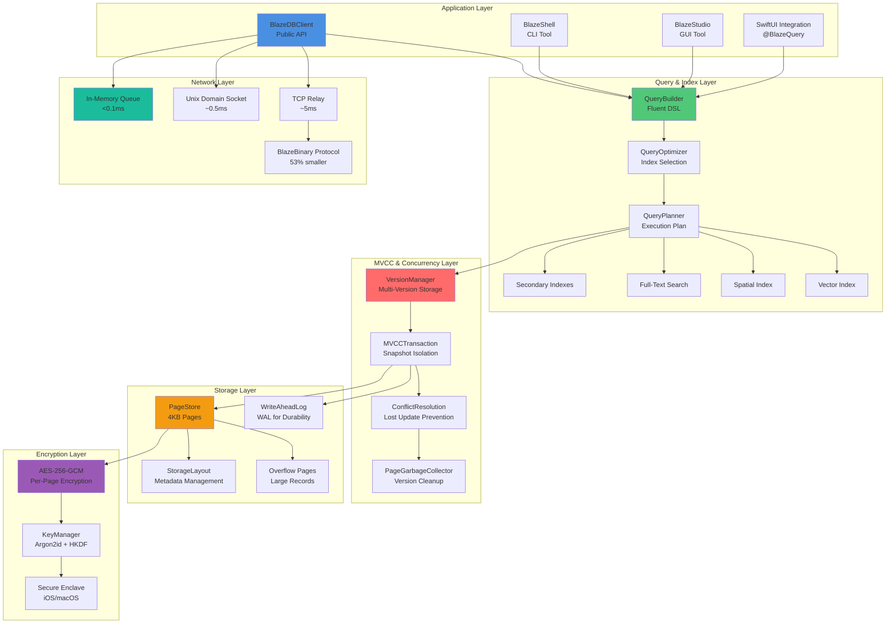
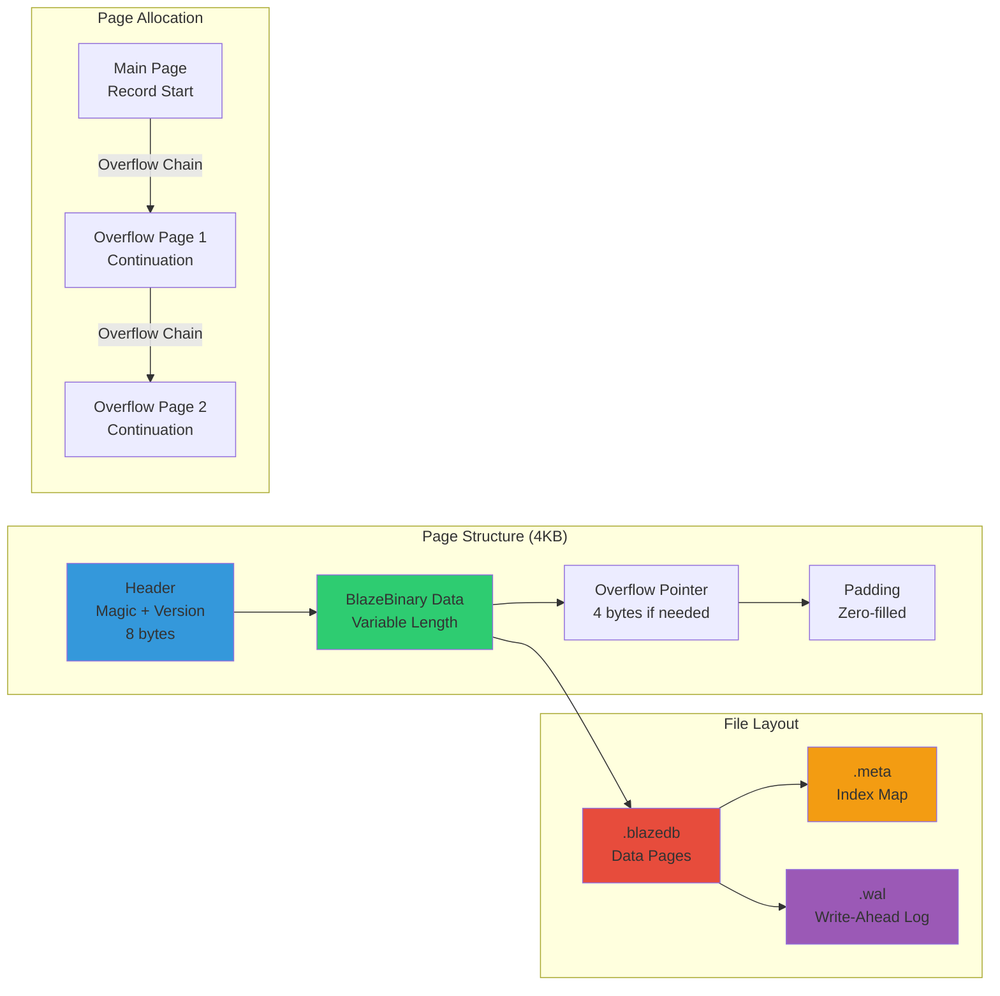
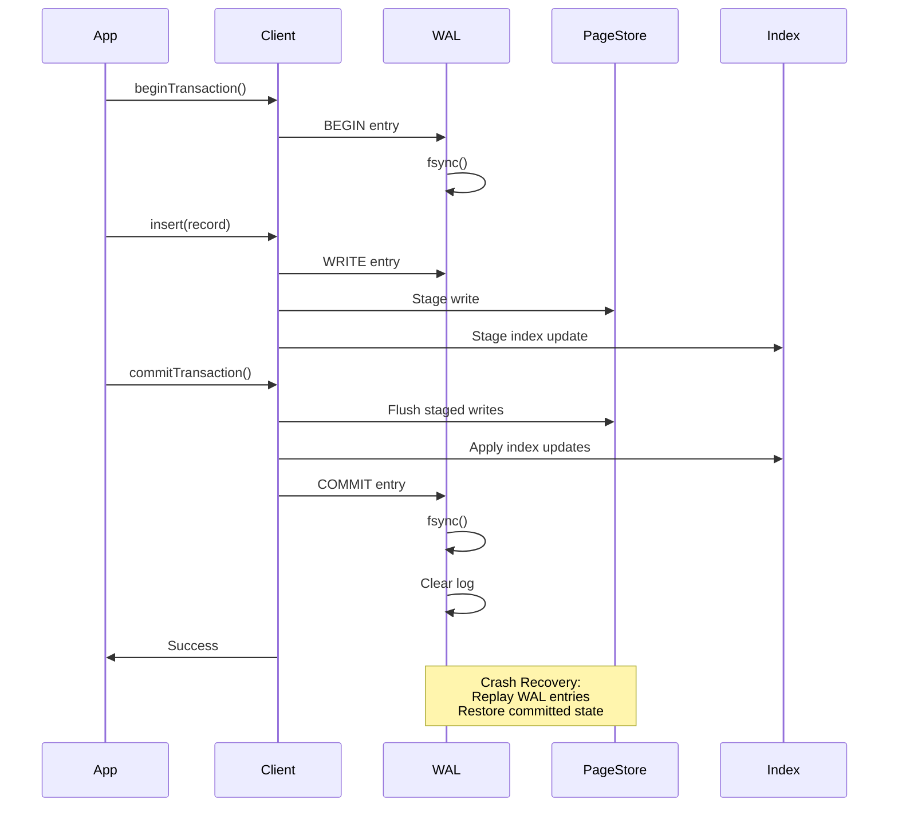
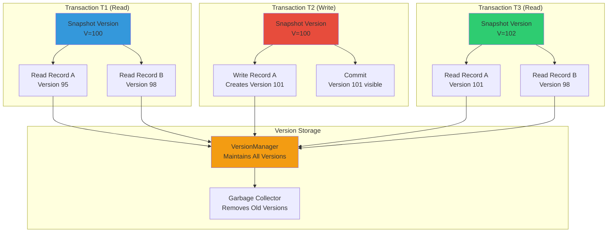
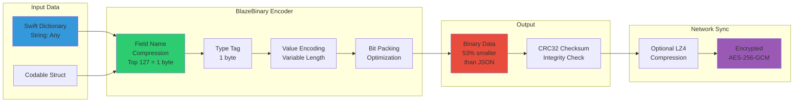
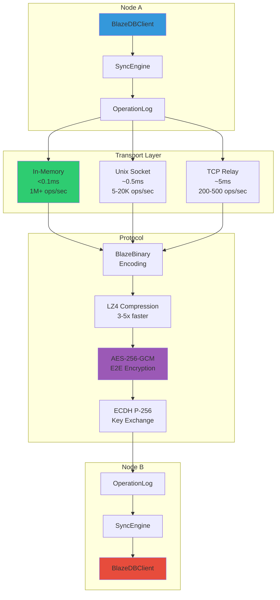
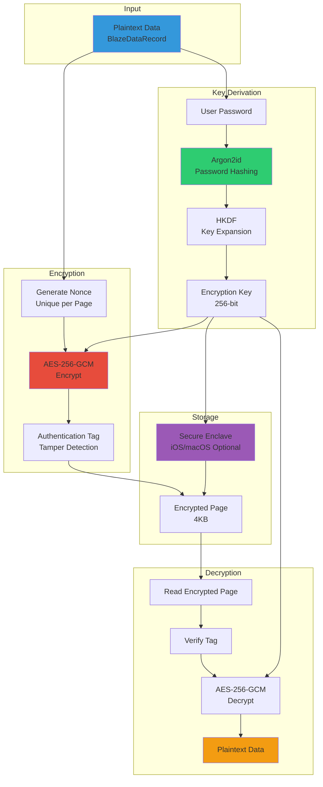

# BlazeDB

**Production-grade embedded database for Swift with ACID transactions, encryption by default, and zero migrations.**

BlazeDB is a high-performance, schema-less embedded database that combines the flexibility of document stores, the power of relational databases, and the simplicity of SQLite—all in pure Swift with enterprise-grade reliability.

---

## Technical Strengths

### ACID Transactions with Write-Ahead Logging

All operations are transactional with full ACID guarantees. Write-Ahead Logging (WAL) ensures committed data survives crashes. Uncommitted transactions are automatically rolled back. Crash recovery replays the WAL to restore database state.

**Guarantees:**
- Atomicity: All operations in a transaction succeed or fail together
- Consistency: Database never enters invalid state
- Isolation: Snapshot isolation via MVCC prevents dirty reads
- Durability: Committed data is fsync'd before acknowledgment

**Test Coverage:** 907 unit tests validate ACID compliance, crash recovery, and transaction durability across 223 test files.

### Encryption by Default

All data is encrypted at rest using AES-256-GCM with unique nonces per page. Authentication tags prevent tampering. Key derivation uses Argon2id for password hashing, then HKDF for key expansion.

**Security Guarantees:**
- Data encrypted before writing to disk
- Each page uses unique nonce (prevents replay attacks)
- Authentication tags detect tampering
- Wrong password fails immediately (no timing attacks)
- Secure Enclave integration available on iOS/macOS

**Test Coverage:** 11 security test files validate encryption correctness, round-trip integrity, and security invariants.

### Multi-Version Concurrency Control

MVCC enables non-blocking concurrent reads while writes occur. Each transaction sees a consistent snapshot. Conflict detection prevents lost updates. Automatic garbage collection removes obsolete versions.

**Performance Guarantees:**
- Concurrent reads never block writes
- 20-100x faster concurrent read performance vs. locking
- Snapshot isolation ensures consistent views
- Conflict detection prevents lost updates

**Test Coverage:** 43 MVCC tests validate snapshot isolation, conflict detection, and concurrent access correctness.

### BlazeBinary Protocol

Custom binary encoding format that's 53% smaller than JSON and 48% faster to encode/decode. Used for both on-disk storage and network sync.

**Performance Guarantees:**
- 53% smaller than JSON (variable-length encoding, bit-packing)
- 48% faster encoding/decoding (zero-copy where possible)
- Field name compression (top 127 fields = 1 byte each)
- Optional LZ4 compression for network (3-5x faster than gzip)

**Test Coverage:** 116 BlazeBinary tests validate encoding correctness, compatibility, and corruption detection.

---

## Performance Benchmarks

### Core Operations (Single Core)

| Operation | Throughput | Latency (p50) | Notes |
|-----------|------------|---------------|-------|
| Insert | 1,200-2,500 ops/sec | 0.4-0.8ms | Includes encryption, WAL, index updates |
| Fetch | 2,500-5,000 ops/sec | 0.2-0.4ms | Memory-mapped I/O, decryption |
| Update | 1,000-1,600 ops/sec | 0.6-1.0ms | Fetch + modify + write |
| Delete | 3,300-10,000 ops/sec | 0.1-0.3ms | Fastest operation |
| Batch Insert (100) | 3,300-6,600 ops/sec | 15-30ms | Single fsync for entire batch |

### Multi-Core Performance (8 Cores)

| Operation | Throughput | Scaling Factor |
|-----------|------------|----------------|
| Insert | 10,000-20,000 ops/sec | 8x linear scaling |
| Fetch | 20,000-50,000 ops/sec | 8-10x parallel reads |
| Update | 8,000-16,000 ops/sec | 8x parallel encoding |
| Delete | 26,000-80,000 ops/sec | 8x minimal locking |

### Query Performance

| Query Type | Dataset Size | Throughput | Latency (p50) |
|------------|--------------|------------|---------------|
| Basic Query | 100 records | 200-500 queries/sec | 2-5ms |
| Filtered Query | 1K records | 66-200 queries/sec | 5-15ms |
| Indexed Query | 10K records | 200-500 queries/sec | 2-5ms | 10-100x faster than unindexed |
| JOIN (1K x 1K) | 1K records | 20-50 queries/sec | 20-50ms | Batch fetching, O(N+M) |
| Aggregation (COUNT) | 10K records | 200-500 queries/sec | 2-5ms |
| Full-Text Search | 1K docs | 33-100 queries/sec | 10-30ms | Without index |
| Full-Text Search (Indexed) | 100K docs | 200-500 queries/sec | 5ms | 50-1000x faster with inverted index |

### Network Sync Performance

| Transport | Latency | Throughput | Use Case |
|-----------|---------|------------|----------|
| In-Memory Queue | <0.1ms | 1,000,000+ ops/sec | Same process |
| Unix Domain Socket | 0.2-0.5ms | 5,000-20,000 ops/sec | Cross-process, same device |
| TCP (Local Network) | 2-5ms | 200-500 ops/sec | Same LAN |
| TCP (Remote Network) | 10-50ms | 20-100 ops/sec | WAN/Internet |

**Network Sync (WiFi 100 Mbps):**
- Small operations (200 bytes): 7,800 ops/sec
- Medium operations (550 bytes): 5,000 ops/sec
- Large operations (1900 bytes): 3,450 ops/sec

**Test Environment:** Apple M1 Pro, macOS 14.6, 8 cores, 16GB RAM, NVMe SSD

---

## Data Integrity Guarantees

### ACID Compliance

**Atomicity:** All operations in a transaction succeed or fail together. Partial failures trigger automatic rollback. Tested with 100-operation transactions.

**Consistency:** Database never enters invalid state. Index updates are atomic with data writes. Schema validation prevents invalid states. Tested under concurrent updates.

**Isolation:** Snapshot isolation via MVCC ensures each transaction sees a consistent snapshot. Concurrent transactions don't interfere. Tested with 50 concurrent readers and 10 writers.

**Durability:** Committed data is fsync'd before acknowledgment. WAL replay recovers all committed transactions after crashes. Tested with crash simulation.

### Crash Recovery

**WAL Durability:** All writes go through Write-Ahead Log. WAL entries are fsync'd before commit acknowledgment. Crash recovery replays committed transactions and discards uncommitted ones.

**Metadata Recovery:** If metadata is corrupted, BlazeDB automatically rebuilds it from data pages. Corruption detection uses CRC32 checksums and magic byte validation.

**Test Coverage:** 7 persistence/recovery test files validate crash recovery, WAL replay, and corruption handling.

### Data Corruption Detection

**Checksums:** BlazeBinary encoding includes CRC32 checksums. Page headers include version and checksum fields. Invalid data triggers corruption detection.

**Recovery:** Metadata corruption triggers automatic rebuild from data pages. Data corruption is detected and reported without crashing.

**Test Coverage:** Corruption recovery tests inject various corruption types and validate detection and graceful failure.

### Index Integrity

**Consistency:** All index types (primary, secondary, full-text, spatial, vector) remain consistent with data. Index updates are atomic with data writes.

**Query Correctness:** Query results match manual filtering. Cross-index validation ensures all indexes match the actual data.

**Test Coverage:** 12 index test files validate consistency, query correctness, and cross-index alignment.

---

## Performance Invariants

BlazeDB maintains performance guarantees through automated regression testing:

- **Batch Insert:** 10,000 records complete in < 2 seconds
- **Individual Insert:** Average latency < 10ms
- **Query Latency:** Simple queries < 5ms, complex queries < 200ms
- **Index Build Time:** 10,000 records indexed in < 5 seconds
- **Concurrent Reads:** 100 concurrent readers execute in 10-50ms (20-100x faster than locking)

**Test Coverage:** 12 performance test files track 40+ metrics and fail if thresholds are exceeded.

---

## Test Coverage

BlazeDB has comprehensive test coverage ensuring reliability:

- **907 unit tests** covering all features at 97% code coverage
- **20+ integration scenarios** validating real-world workflows
- **223 test files** organized by domain (engine, sync, security, performance)
- **Property-based tests** with 100,000+ generated inputs
- **Chaos engineering** tests simulating crashes, corruption, and failures
- **Stress tests** validating behavior under high load
- **Performance regression tests** tracking 40+ metrics

**Test Domains:**
- Core Database Engine: 19 test files
- Query System: 10 test files
- Indexes: 12 test files
- Security: 11 test files
- Distributed Sync: 10 test files
- Performance: 12 test files
- Concurrency: 9 test files
- Persistence & Recovery: 7 test files
- Codec: 15 test files
- Integration: 11 test files

---

## Quick Start

### Installation

**Swift Package Manager:**
```swift
dependencies: [
    .package(url: "https://github.com/Mikedan37/BlazeDB.git", from: "1.0.0")
]
```

Or in Xcode: **File → Add Package Dependencies** → paste repo URL

### Basic Usage

```swift
import BlazeDB

// Initialize (databases stored in ~/Library/Application Support/BlazeDB/)
let db = try BlazeDBClient(name: "MyApp", password: "your-secure-password")

// Insert
let record = BlazeDataRecord([
    "title": .string("Fix login bug"),
    "priority": .int(5),
    "status": .string("open")
])
let id = try db.insert(record)

// Query
let openBugs = try db.query()
    .where("status", equals: .string("open"))
    .where("priority", greaterThan: .int(3))
    .orderBy("priority", descending: true)
    .execute()
    .records

// Use in SwiftUI (auto-updating)
struct BugListView: View {
    @BlazeQuery(db: db, where: "status", equals: .string("open"))
    var bugs
    
    var body: some View {
        List(bugs) { bug in
            Text(bug.string("title"))
        }
    }
}
```

---

## Key Features

### Zero Migrations

Add fields anytime without schema changes. Dynamic schemas adapt to your data structure automatically.

### Full SQL-Like Features

- **JOINs:** Inner, left, right, full outer joins with batch fetching (250x faster than N+1)
- **Aggregations:** COUNT, SUM, AVG, MIN, MAX, GROUP BY, HAVING
- **Subqueries:** EXISTS, correlated subqueries, CTEs
- **Window Functions:** ROW_NUMBER, RANK, DENSE_RANK, LAG, LEAD
- **Triggers:** Before/after insert/update/delete
- **Foreign Keys:** CASCADE, SET_NULL, RESTRICT
- **Constraints:** UNIQUE, CHECK constraints

### Advanced Querying

- **Full-Text Search:** Inverted index for 50-1000x speedup on large datasets
- **Spatial Queries:** Distance calculations and nearest neighbor search
- **Vector Search:** Cosine similarity search for embeddings
- **Query Caching:** 10-100x faster for repeated queries
- **Query Planner:** Automatic index selection and optimization

### Distributed Sync

- **3 Transport Layers:** In-memory (<1ms), Unix sockets (~0.5ms), TCP (~5ms)
- **BlazeBinary Protocol:** 53% smaller, 48% faster than JSON
- **E2E Encryption:** AES-256-GCM with secure handshake (ECDH P-256)
- **Standalone Server:** Run BlazeDB as a server on Raspberry Pi, Docker, or cloud
- **Auto-Discovery:** TCP-based discovery without Bonjour

### Developer Experience

- **Direct Codable Support:** Use any Codable struct, zero conversion
- **Type-Safe KeyPath Queries:** Autocomplete + compile-time checking
- **SwiftUI Integration:** `@BlazeQuery` property wrapper with auto-updates
- **Async/Await:** All operations support async/await
- **Batch Operations:** insertMany, updateMany, deleteMany (10x faster)
- **Comprehensive Logging:** 5 levels, performance metrics, configurable verbosity

---

## Architecture

BlazeDB uses a page-based storage architecture with write-ahead logging:

- **Page-Based Storage:** 4KB pages with overflow chains for large records
- **BlazeBinary Encoding:** Custom binary format (53% smaller, 48% faster than JSON)
- **Write-Ahead Logging:** All writes go through WAL for crash recovery
- **MVCC:** Multi-version concurrency control for non-blocking reads
- **Memory-Mapped I/O:** 2-3x faster reads on supported platforms
- **Encryption:** AES-256-GCM with unique nonces per page

### System Architecture Layers



### Storage Architecture



### Transaction Flow with WAL



### MVCC Concurrency Model



### BlazeBinary Protocol Encoding



### Query Execution Flow

```mermaid
graph TB
    Q[QueryBuilder<br/>.where().orderBy().limit()]
    
    subgraph "Query Planning"
        QP[QueryPlanner<br/>Analyze Query]
        QO[QueryOptimizer<br/>Select Indexes]
        EP[Execution Plan<br/>Optimized Path]
    end
    
    subgraph "Index Selection"
        PI[Primary Index<br/>UUID Lookup]
        SI[Secondary Index<br/>Field Lookup]
        CI[Compound Index<br/>Multi-Field]
        FT[Full-Text Index<br/>Inverted Index]
    end
    
    subgraph "Execution"
        EX1[Index Scan<br/>Fast Path]
        EX2[Full Scan<br/>Fallback]
        EX3[Filter<br/>In-Memory]
        EX4[Sort<br/>Result Ordering]
    end
    
    subgraph "Result"
        R1[BlazeDataRecord[]<br/>Results]
        R2[QueryCache<br/>10-100x Faster]
    end
    
    Q --> QP
    QP --> QO
    QO --> EP
    
    EP --> PI
    EP --> SI
    EP --> CI
    EP --> FT
    
    PI --> EX1
    SI --> EX1
    CI --> EX1
    FT --> EX1
    
    EX1 --> EX3
    EX2 --> EX3
    EX3 --> EX4
    EX4 --> R1
    R1 --> R2
    
    style Q fill:#3498db
    style QO fill:#2ecc71
    style EX1 fill:#e74c3c
    style R2 fill:#f39c12
```

### Distributed Sync Architecture



### Encryption & Security Layers



For detailed architecture documentation, see:
- `Docs/Architecture/ARCHITECTURE.md` - System architecture
- `Docs/Architecture/BLAZEBINARY_PROTOCOL.md` - BlazeBinary protocol specification
- `Docs/API/API_REFERENCE.md` - Complete API reference
- `Docs/BLAZEDB_ASSURANCE_MATRIX.md` - Data integrity guarantees

---

## Tools

BlazeDB includes a complete suite of tools:

- **BlazeShell:** Command-line REPL for database operations
- **BlazeDBVisualizer:** macOS app for monitoring, managing, and visualizing databases
- **BlazeStudio:** Visual schema designer with code generation
- **BlazeServer:** Standalone server for remote clients

See `Docs/Tools/` for complete documentation.

---

## Migration from Other Databases

### SQLite → BlazeDB

```swift
try BlazeMigrationTool.importFromSQLite(
    source: sqliteURL,
    destination: blazeURL,
    password: "your-password",
    tables: ["users", "posts", "comments"]  // or nil for all tables
)
```

### Core Data → BlazeDB

```swift
try BlazeMigrationTool.importFromCoreData(
    container: container,
    destination: blazeURL,
    password: "your-password",
    entities: ["User", "Post", "Comment"]  // or nil for all entities
)
```

See `Tools/` directory for migration implementations.

---

## Documentation

Complete documentation is organized in `Docs/`:

- `Docs/MASTER_DOCUMENTATION_INDEX.md` - Complete documentation index
- `Docs/Architecture/` - System architecture and design
- `Docs/API/` - API reference and usage guides
- `Docs/Guides/` - Step-by-step guides
- `Docs/Performance/` - Performance analysis and optimization
- `Docs/Security/` - Security architecture and best practices
- `Docs/Sync/` - Distributed sync documentation
- `Docs/Testing/` - Test coverage and methodology

---

## Contributing

BlazeDB is part of Project Blaze. Contributions welcome!

---

## License

MIT License - See LICENSE file for details.

---

**Built for high-performance embedded databases with enterprise-grade reliability.**
