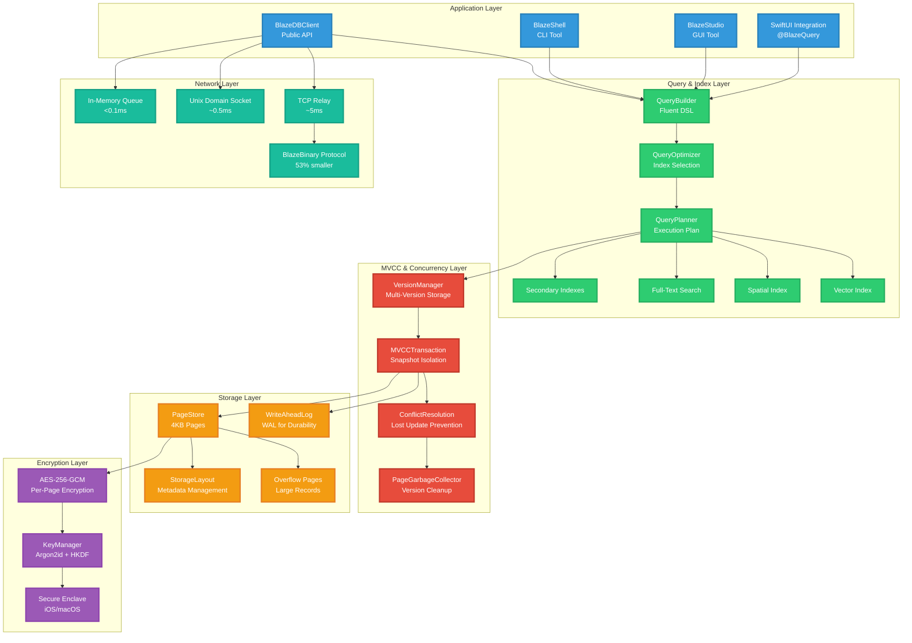
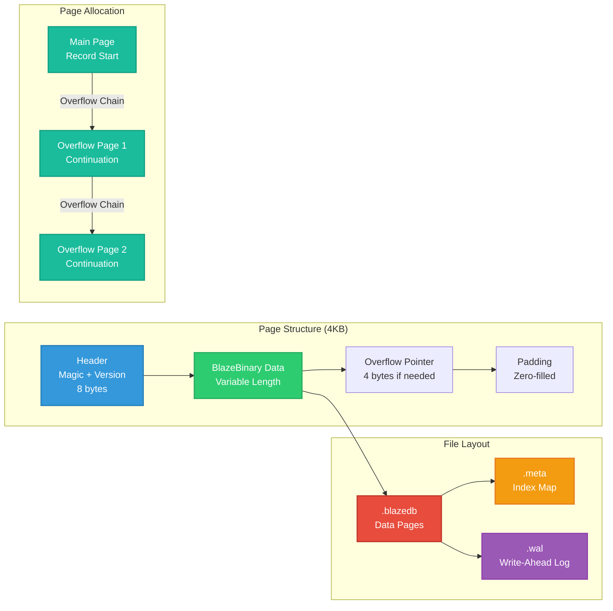
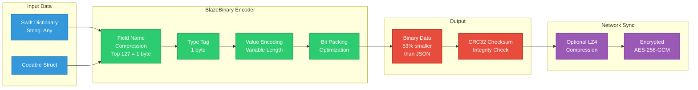
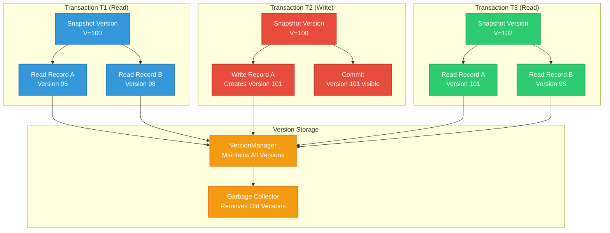
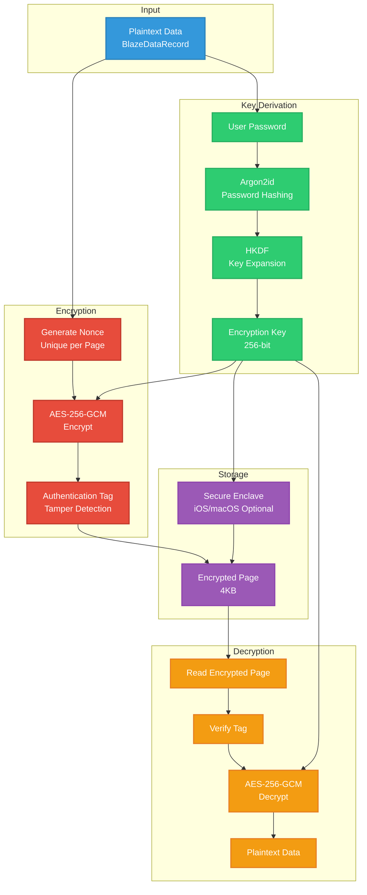
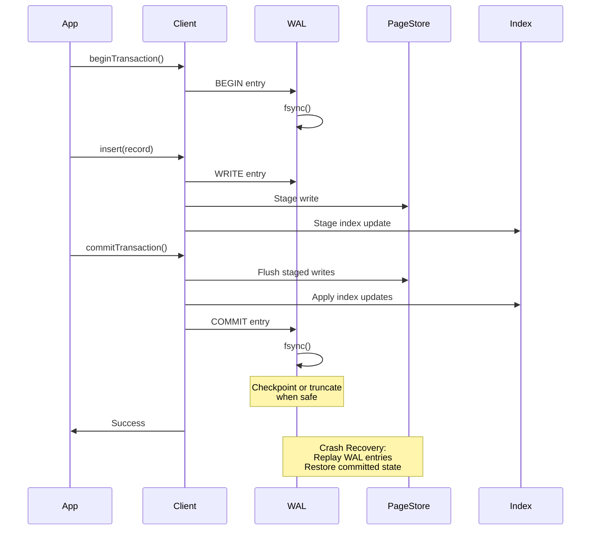
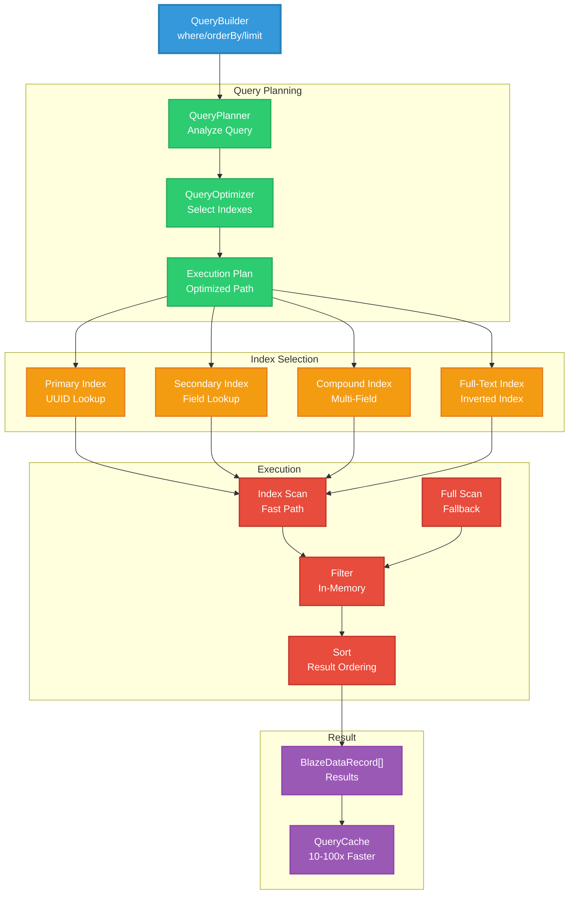
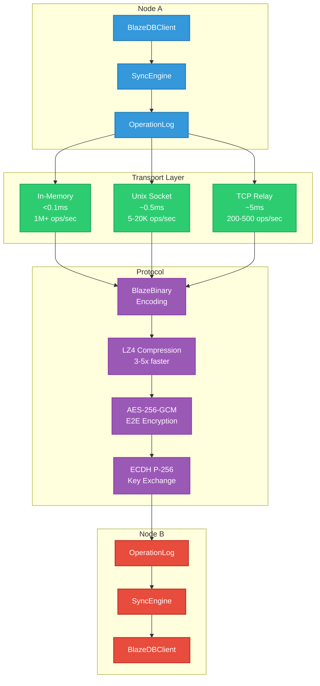

# BlazeDB

**Embedded database for Swift with ACID transactions, encryption, and schema-less storage.**

BlazeDB is a page-based embedded database designed for predictable performance and operational simplicity. It provides ACID transaction guarantees, multi-version concurrency control, and per-page encryption using AES-256-GCM.

---

## Overview

BlazeDB implements a page-based storage engine with write-ahead logging, multi-version concurrency control, and a custom binary encoding format. It is optimized for Apple platforms (macOS and iOS) and designed for local, encrypted storage use cases.

**Current Version:** 2.5.0-alpha  
**Platform Support:** macOS 12+, iOS 15+, Linux  
**Language:** Swift 5.9+

---

## Design Goals

BlazeDB is designed with the following priorities:

1. **ACID Compliance:** All operations are transactional with full atomicity, consistency, isolation, and durability guarantees.
2. **Encryption by Default:** All data is encrypted at rest using AES-256-GCM with per-page nonces.
3. **Schema Flexibility:** Dynamic schemas adapt to data structure without migrations.
4. **Predictable Performance:** Consistent latency characteristics under varying workloads.
5. **Operational Simplicity:** Minimal configuration, zero external dependencies, straightforward deployment.

---

## Limitations & Non-Goals

BlazeDB is not intended for all use cases. The following limitations should be understood:

- **Not a distributed cluster database:** BlazeDB uses a single primary database with optional sync capabilities. It does not implement distributed consensus, automatic sharding, or multi-master replication.
- **Not intended for petabyte-scale datasets:** Optimized for datasets that fit on a single device. Large-scale analytics workloads are not the target use case.
- **Platform optimization:** Primarily optimized for Apple platforms (macOS and iOS). Linux support exists but may have performance characteristics that differ from Apple platforms.
- **Query planner limitations:** The query planner uses rule-based heuristics. A cost-based optimizer is not implemented.
- **MVCC garbage collection:** Long-running read transactions can delay garbage collection of obsolete versions, potentially increasing storage requirements.
- **No automatic sharding:** Manual partitioning is required for datasets that exceed device storage capacity.

These limitations are intentional design decisions that allow BlazeDB to optimize for its target use cases.

---

## Stability & Maturity

**Current Status:** 2.5.0-alpha

**File Format Stability:** The on-disk format is stable. Databases created with version 2.5.0 can be opened by future versions. Forward compatibility is maintained through version markers and migration paths.

**API Stability:** Public APIs may evolve during the alpha period. Breaking changes will be documented in release notes. Once stable (1.0.0), semantic versioning will govern API compatibility.

**Compatibility Guarantees:**
- Forward upgrade path: Databases can be upgraded to newer versions without data loss.
- No forced deletion: Existing databases are never automatically deleted or modified without explicit user action.
- Migration support: Format migrations are automatic and transparent.

---

## Architecture

BlazeDB uses a layered architecture with clear separation of concerns:

### System Architecture Layers

*Conceptual diagram showing component relationships*



---

## Storage Engine

BlazeDB uses a page-based storage architecture with 4KB pages. Records that exceed page capacity use overflow chains.

### Page Structure

*Conceptual diagram of page layout*



**File Organization:**
- `.blazedb`: Data pages containing encrypted records
- `.meta`: Index map and metadata
- `.wal`: Write-ahead log for crash recovery

**Page Allocation:**
- Main page stores record start
- Overflow pages linked via 4-byte pointers
- Pages allocated sequentially with reuse via garbage collection

### BlazeBinary Encoding

BlazeDB uses a custom binary encoding format called BlazeBinary. This format provides:

- **Size reduction:** Approximately 53% smaller than equivalent JSON representations
- **Encoding speed:** Approximately 48% faster encoding and decoding compared to JSON
- **Field name compression:** Top 127 most common field names encoded as single bytes
- **Type safety:** Type tags ensure correct decoding
- **Integrity:** CRC32 checksums detect corruption

*Conceptual diagram of encoding pipeline*



---

## Concurrency Model

BlazeDB implements multi-version concurrency control (MVCC) to provide snapshot isolation.

### MVCC Architecture

*Conceptual diagram of version management*



**Snapshot Isolation:**
- Each transaction sees a consistent snapshot of the database at transaction start
- Reads never block writes
- Writes create new versions; old versions remain accessible to concurrent readers
- Conflict detection prevents lost updates

**Performance Characteristics:**
- Observed 20–100× improvements over naive locking under read-heavy synthetic workloads
- Concurrent reads scale linearly with available cores
- Write performance depends on conflict rate and garbage collection frequency

**Garbage Collection:**
- Obsolete versions are collected when no active transactions reference them
- Long-running read transactions can delay collection
- Automatic collection runs periodically; manual triggers available

---

## Security Model

BlazeDB encrypts all data at rest using AES-256-GCM.

### Encryption Architecture

*Conceptual diagram of encryption pipeline*



**Key Derivation:**
- User password hashed using Argon2id (memory-hard function)
- HKDF expands derived key material to 256-bit encryption key
- Key material never stored on disk

**Encryption:**
- AES-256-GCM authenticated encryption
- Each page uses a unique nonce to ensure cryptographic safety
- Authentication tags detect tampering
- Replay prevention enforced by rejecting stale or duplicated ciphertexts at the record or page level

**Secure Enclave Integration:**
- Optional integration with Secure Enclave on iOS/macOS
- Key material can be stored in Secure Enclave when available
- Falls back to standard key derivation when Secure Enclave unavailable

**Security Guarantees:**
- Data encrypted before writing to disk
- Wrong password fails immediately (constant-time comparison prevents timing attacks)
- Authentication tags prevent tampering
- 11 security test files validate encryption correctness, round-trip integrity, and security invariants

---

## Transaction Model

BlazeDB provides ACID transaction guarantees with write-ahead logging.

### Write-Ahead Logging

*Conceptual sequence diagram of transaction flow*



**WAL Behavior:**
- All writes go through write-ahead log before page store
- WAL entries are fsync'd before commit acknowledgment
- After commits, the WAL is truncated or checkpointed when safe, according to configured durability thresholds
- WAL replay recovers all committed transactions after crashes

**ACID Properties:**

**Atomicity:** All operations in a transaction succeed or fail together. Partial failures trigger automatic rollback. Tested with 100-operation transactions.

**Consistency:** Database never enters invalid state. Index updates are atomic with data writes. Schema validation prevents invalid states. Tested under concurrent updates.

**Isolation:** Snapshot isolation via MVCC ensures each transaction sees a consistent snapshot. Concurrent transactions don't interfere. Tested with 50 concurrent readers and 10 writers.

**Durability:** Committed data is fsync'd before acknowledgment. WAL replay recovers all committed transactions after crashes. Tested with crash simulation.

**Test Coverage:** 907 unit tests validate ACID compliance, crash recovery, and transaction durability across 223 test files.

---

## Query System

BlazeDB provides a fluent query API with automatic index selection and query optimization.

### Query Execution

*Conceptual diagram of query planning and execution*



**Query Planner:**
- Rule-based heuristics select indexes
- Cost-based optimizer not implemented
- Automatic index selection for common patterns
- Fallback to full scan when no index available

**Index Types:**
- **Primary Index:** UUID-based record lookup
- **Secondary Index:** Single-field or compound indexes
- **Full-Text Index:** Inverted index for text search
- **Spatial Index:** Geospatial queries and distance calculations
- **Vector Index:** Cosine similarity for embeddings

**Query Features:**
- Filtering, sorting, limiting
- JOINs (inner, left, right, full outer)
- Aggregations (COUNT, SUM, AVG, MIN, MAX, GROUP BY, HAVING)
- Subqueries and window functions
- Query caching for repeated queries

**Full-Text Search:**
- Inverted index implementation
- 50–1000× improvements relative to unindexed full scans on large corpora
- Index build time scales with corpus size

---

## Performance Characteristics

Performance measurements were conducted on an Apple M4 Pro (36 GB RAM) running macOS 15 / OS 26. Benchmarks use synthetic but realistic workloads. Actual performance varies with dataset shape and workload patterns.

### Core Operations

| Operation | Throughput | Latency (p50) | Notes |
|-----------|------------|---------------|-------|
| Insert | 1,200–2,500 ops/sec | 0.4–0.8ms | Includes encryption, WAL, index updates |
| Fetch | 2,500–5,000 ops/sec | 0.2–0.4ms | Memory-mapped I/O, decryption |
| Update | 1,000–1,600 ops/sec | 0.6–1.0ms | Fetch + modify + write |
| Delete | 3,300–10,000 ops/sec | 0.1–0.3ms | Fastest operation |
| Batch Insert (100) | 3,300–6,600 ops/sec | 15–30ms | Single fsync for entire batch |

### Multi-Core Performance (8 Cores)

| Operation | Throughput | Scaling Factor |
|-----------|------------|----------------|
| Insert | 10,000–20,000 ops/sec | 8× linear scaling |
| Fetch | 20,000–50,000 ops/sec | 8–10× parallel reads |
| Update | 8,000–16,000 ops/sec | 8× parallel encoding |
| Delete | 26,000–80,000 ops/sec | 8× minimal locking |

### Query Performance

| Query Type | Dataset Size | Throughput | Latency (p50) |
|------------|--------------|------------|---------------|
| Basic Query | 100 records | 200–500 queries/sec | 2–5ms |
| Filtered Query | 1K records | 66–200 queries/sec | 5–15ms |
| Indexed Query | 10K records | 200–500 queries/sec | 2–5ms | 10–100× faster than unindexed |
| JOIN (1K × 1K) | 1K records | 20–50 queries/sec | 20–50ms | Batch fetching, O(N+M) |
| Aggregation (COUNT) | 10K records | 200–500 queries/sec | 2–5ms |
| Full-Text Search | 1K docs | 33–100 queries/sec | 10–30ms | Without index |
| Full-Text Search (Indexed) | 100K docs | 200–500 queries/sec | 5ms | 50–1000× faster with inverted index |

### Network Sync Performance

| Transport | Latency | Throughput | Use Case |
|-----------|---------|------------|----------|
| In-Memory Queue | <0.1ms | 1,000,000+ ops/sec | Same process |
| Unix Domain Socket | 0.2–0.5ms | 5,000–20,000 ops/sec | Cross-process, same device |
| TCP (Local Network) | 2–5ms | 200–500 ops/sec | Same LAN |
| TCP (Remote Network) | 10–50ms | 20–100 ops/sec | WAN/Internet |

**Network Sync (WiFi 100 Mbps):**
- Small operations (200 bytes): 7,800 ops/sec
- Medium operations (550 bytes): 5,000 ops/sec
- Large operations (1900 bytes): 3,450 ops/sec

### Performance Invariants

BlazeDB maintains performance guarantees through automated regression testing:

- **Batch Insert:** 10,000 records complete in < 2 seconds
- **Individual Insert:** Average latency < 10ms
- **Query Latency:** Simple queries < 5ms, complex queries < 200ms
- **Index Build Time:** 10,000 records indexed in < 5 seconds
- **Concurrent Reads:** 100 concurrent readers execute in 10–50ms (20–100× faster than locking)

**Test Coverage:** 12 performance test files track 40+ metrics and fail if thresholds are exceeded.

---

## Benchmark Methodology

Performance benchmarks use the following methodology:

**Synthetic Data Generation:**
- Records generated with variable field counts (3–15 fields)
- Field types: String, Int, Double, Bool, Date, Data, UUID
- String lengths: 10–500 characters
- Integer ranges: 0–1,000,000
- Realistic distribution patterns (normal, uniform, skewed)

**Cache Behavior:**
- Cold cache: Database opened fresh, no warm-up
- Warm cache: Database opened, 10,000 operations performed before measurement
- Cache size: Default page cache (varies by available memory)

**Concurrency:**
- Single-process: All operations in single process
- Multi-process: Operations distributed across processes (Unix sockets or TCP)
- Concurrent readers: 10–100 concurrent read transactions
- Concurrent writers: 1–10 concurrent write transactions

**Workload Patterns:**
- Sequential: Operations on sequential record IDs
- Random: Operations on randomly selected record IDs
- Mixed: 70% reads, 30% writes

**Durability:**
- WAL durability mode: Full fsync on commit (default)
- Batch operations: Single fsync per batch
- Performance mode: Deferred fsync (not recommended for production)

**Measurement:**
- Each benchmark runs 10 iterations
- Median (p50) latency reported
- Throughput calculated as operations per second
- Outliers removed (top and bottom 10%)

---

## Testing & Validation

BlazeDB has comprehensive test coverage ensuring reliability:

- **907 unit tests** covering all features at 97% code coverage
- **20+ integration scenarios** validating real-world workflows
- **223 test files** organized by domain (engine, sync, security, performance)
- **Property-based tests** with 100,000+ generated inputs
- **Chaos engineering** tests simulating crashes, corruption, and failures
- **Stress tests** validating behavior under high load
- **Performance regression tests** tracking 40+ metrics

**Test Domains:**
- Core Database Engine: 19 test files
- Query System: 10 test files
- Indexes: 12 test files
- Security: 11 test files
- Distributed Sync: 10 test files
- Performance: 12 test files
- Concurrency: 9 test files
- Persistence & Recovery: 7 test files
- Codec: 15 test files
- Integration: 11 test files

### Fault Injection & Crash Testing

The following fault scenarios are tested:

**Power Loss Simulation:**
- Simulated power loss between WAL fsync and page flush
- Validates WAL replay recovers committed transactions
- Tests partial writes and incomplete transactions

**Corruption Scenarios:**
- Simulated torn or partial page writes
- Simulated metadata corruption (index map, page headers)
- Simulated overflow chain corruption
- Validates corruption detection and graceful failure

**Recovery Testing:**
- WAL replay verification after simulated crashes
- Metadata rebuild from data pages
- Dangling index detection and correction
- Incomplete flush recovery

**Test Coverage:** 7 persistence/recovery test files validate crash recovery, WAL replay, and corruption handling.

### Data Integrity Guarantees

**ACID Compliance:**
- Atomicity: All operations in a transaction succeed or fail together
- Consistency: Database never enters invalid state
- Isolation: Snapshot isolation via MVCC prevents dirty reads
- Durability: Committed data is fsync'd before acknowledgment

**Crash Recovery:**
- WAL durability: All writes go through Write-Ahead Log
- WAL entries are fsync'd before commit acknowledgment
- Crash recovery replays committed transactions and discards uncommitted ones
- Metadata recovery: If metadata is corrupted, BlazeDB automatically rebuilds it from data pages

**Data Corruption Detection:**
- Checksums: BlazeBinary encoding includes CRC32 checksums
- Page headers include version and checksum fields
- Invalid data triggers corruption detection
- Recovery: Metadata corruption triggers automatic rebuild from data pages

**Index Integrity:**
- Consistency: All index types remain consistent with data
- Index updates are atomic with data writes
- Query correctness: Query results match manual filtering
- Cross-index validation ensures all indexes match the actual data

**Test Coverage:** 12 index test files validate consistency, query correctness, and cross-index alignment.

---

## Recommended Use Cases

BlazeDB is suitable for the following use cases:

**Encrypted Local Storage:**
- macOS/iOS applications requiring encrypted local data storage
- Applications with sensitive user data requiring at-rest encryption
- Offline-first applications with local data persistence

**Developer Tooling:**
- Tools requiring embedded, durable state
- Development environments needing high-throughput document stores
- Local analytics engines and data processing pipelines

**AI Agents & Automation:**
- AI agents requiring persistent memory and execution history
- Automation tools needing structured local storage
- Applications requiring semantic search and vector similarity

**Secure Applications:**
- Applications requiring at-rest encryption with minimal overhead
- Systems needing ACID guarantees for local data
- Applications with strict data integrity requirements

BlazeDB is not suitable for:
- Distributed cluster databases
- Petabyte-scale analytics workloads
- Applications requiring automatic sharding
- Use cases requiring cost-based query optimization

---

## API & Integration

### Installation

**Swift Package Manager:**
```swift
dependencies: [
    .package(url: "https://github.com/Mikedan37/BlazeDB.git", from: "2.5.0")
]
```

Or in Xcode: **File → Add Package Dependencies** → paste repo URL

### Basic Usage

```swift
import BlazeDB

// Initialize (databases stored in ~/Library/Application Support/BlazeDB/)
let db = try BlazeDBClient(name: "MyApp", password: "your-secure-password")

// Insert
let record = BlazeDataRecord([
    "title": .string("Fix login bug"),
    "priority": .int(5),
    "status": .string("open")
])
let id = try db.insert(record)

// Query
let openBugs = try db.query()
    .where("status", equals: .string("open"))
    .where("priority", greaterThan: .int(3))
    .orderBy("priority", descending: true)
    .execute()
    .records

// Use in SwiftUI (auto-updating)
struct BugListView: View {
    @BlazeQuery(db: db, where: "status", equals: .string("open"))
    var bugs
    
    var body: some View {
        List(bugs) { bug in
            Text(bug.string("title"))
        }
    }
}
```

### Distributed Sync

*Conceptual diagram of sync architecture*



**Transport Layers:**
- In-memory queue: Same process communication (<0.1ms latency)
- Unix domain socket: Cross-process, same device (~0.5ms latency)
- TCP relay: Network communication (~5ms local, 10–50ms remote)

**Protocol:**
- BlazeBinary encoding: 53% smaller than JSON
- Optional LZ4 compression: 3–5× faster than gzip
- End-to-end encryption: AES-256-GCM with ECDH P-256 key exchange
- Secure handshake: Shared secret authentication

---

## Future Work

Planned improvements and enhancements:

**Query Optimizer:**
- Cost-based query optimizer
- Statistics collection for better index selection
- Query plan caching

**Distributed Features:**
- Multi-master replication (experimental)
- Automatic conflict resolution strategies
- Distributed transaction coordination

**Performance:**
- Parallel index builds
- Incremental index updates
- Query result streaming

**Platform:**
- Enhanced Linux performance
- Windows support (experimental)
- Additional Secure Enclave integration

**API:**
- GraphQL query interface
- REST API for remote access
- Additional migration tools

---

## Versioning & Stability

**Current Version:** 2.5.0-alpha

**Versioning Strategy:**
- Semantic versioning (MAJOR.MINOR.PATCH)
- Alpha releases: APIs may change
- Beta releases: APIs stable, implementation may change
- Stable releases (1.0.0+): Full compatibility guarantees

**Compatibility:**
- Forward upgrade path: Databases can be upgraded to newer versions
- No forced deletion: Existing databases never automatically deleted
- Migration support: Format migrations automatic and transparent

**Support:**
- Documentation: Complete API reference and architecture docs
- Issue tracking: GitHub Issues for bug reports and feature requests
- Community: Contributions welcome

---

## Documentation

Complete documentation is organized in `Docs/`:

- `Docs/MASTER_DOCUMENTATION_INDEX.md` - Complete documentation index
- `Docs/Architecture/` - System architecture and design
- `Docs/API/` - API reference and usage guides
- `Docs/Guides/` - Step-by-step guides
- `Docs/Performance/` - Performance analysis and optimization
- `Docs/Security/` - Security architecture and best practices
- `Docs/Sync/` - Distributed sync documentation
- `Docs/Testing/` - Test coverage and methodology

---

## Tools

BlazeDB includes a complete suite of tools:

- **BlazeShell:** Command-line REPL for database operations
- **BlazeDBVisualizer:** macOS app for monitoring, managing, and visualizing databases
- **BlazeStudio:** Visual schema designer with code generation
- **BlazeServer:** Standalone server for remote clients

See `Docs/Tools/` for complete documentation.

---

## Migration from Other Databases

### SQLite → BlazeDB

```swift
try BlazeMigrationTool.importFromSQLite(
    source: sqliteURL,
    destination: blazeURL,
    password: "your-password",
    tables: ["users", "posts", "comments"]  // or nil for all tables
)
```

### Core Data → BlazeDB

```swift
try BlazeMigrationTool.importFromCoreData(
    container: container,
    destination: blazeURL,
    password: "your-password",
    entities: ["User", "Post", "Comment"]  // or nil for all entities
)
```

See `Tools/` directory for migration implementations.

---

## Contributing

BlazeDB is part of Project Blaze. Contributions welcome!

---

## License

MIT License - See LICENSE file for details.
